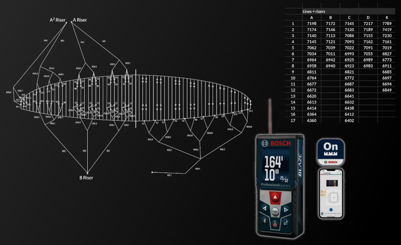

# [BOSCH GLM 50C](https://www.boschtools.com/us/en/products/glm-50-c-0601072C10)

Connect laser rangefinder via bluetooth and pass its readings as keyboard inputs.

Works with [Google Sheets](https://sheets.google.com/),
[Microsoft Excel](https://excel.cloud.microsoft/),
[LibreOffice Calc](https://www.libreoffice.org/discover/calc/) and
[we-measure.io](https://we-measure.io/).

<br />

<p align="center">
    
</p>

<br />


## documentation

* [code](./glm50c.py)

<br />


## usage (linux)

* install dependencies
    ```bash
    $ ./do bootstrap
    ```

* scan for nearby bluetooth devices
    ```bash
    $ ./do run glm50c
    ```

* connect to rangefinder and emulate keyboard inputs
    ```bash
    $ ./do run glm50c XX:XX:XX:XX:XX:XX
    ```

<br />


## usage (manual)

* installation
    ```bash
    $ virtualenv ./.venv/
    $ . ./.venv/bin/activate
    $ pip install --upgrade pip
    $ pip install -r requirements.txt
    ```

* quickstart
    ```bash
    $ python glm50c.py
    Usage: glm50c.py <bluetooth_address>
    ```

<br />

🪂️
